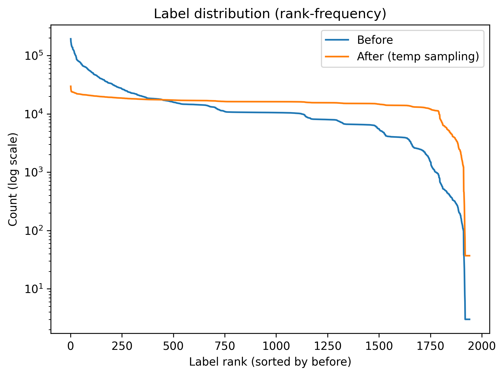

# LIBE

**LIBE** is a sentence-transformer **bi-encoder for language identification (LID)**

Each training example pairs a text segment (anchor) with either a language label or a
natural-language language description (positive)

Model is optimized with
`MultipleNegativesRankingLoss`. A cross-encoder variant is included as well.
The bi-encoder is trained on the [GlotLID corpus](https://github.com/cisnlp/GlotLID)
and evaluated on FLORES-200, UDHR-LID and MCS-350.

## Repository structure

```
├── environment.yml              # conda environment (Python 3.11)
├── train_biencoder.py           # train the bi-encoder
├── train_cross_ecnoder.py       # train the cross-encoder variant
├── eval.py / test.py            # evaluation
├── speed_test.py                # inference speed benchmark
├── data/
│   ├── MCS-350/                 # small eval sets (k = 1, 3, 5)
│   ├── udhr-lid/                # small eval sets (k = 1, 3, 5, full)
│   ├── flores200/               # → on OSF (see below)
│   └── glotlid-corpus/          # → on OSF (see below)
├── models/
│   └── GlotLID-10M_desc/        # trained bi-encoder (weights on OSF)
├── plots/
└── resources/                   # → on OSF (see below)
```

## Setup

```bash
conda env create -f environment.yml
conda activate langRepNew
```

## Large files on OSF

Large data files and model weights are **not** stored in this repository.
They are available on the [OSF project page](https://osf.io/2zhct/)

| File | Size | Link |
|---|---|---|
| `data/glotlid-corpus/train_sampled_10M.tsv` | 1.8 GB | [OSF](https://osf.io/2zhct/files/osfstorage/6a71eecc47da1b4e4fb921c0) |
| `data/glotlid-corpus/train_sampled_30M.tsv.zip` | 2.8 GB | [OSF](https://osf.io/2zhct/files/osfstorage/6989b954f2c8ea0598dfc6f3) |
| `models/GlotLID-10M_desc/model.safetensors` | 1.8 GB | [OSF](https://osf.io/2zhct/files/osfstorage/6a1ffc18a7eb391ce3ffb8f0) |
| `data/flores200/LID.tsv` | 42 MB | [OSF](https://osf.io/2zhct/files/osfstorage/6989b9f59d26780efdc72ce3) |
| `data/flores200/LID.ft` | 44 MB | [OSF](https://osf.io/2zhct/files/osfstorage/6989b9a187d53a80f2dfc61f) |
| `data/flores200/NLLB.tsv` | 41 MB | [OSF](https://osf.io/2zhct/files/osfstorage/6989b9bbcb45daa96cdfc7f0) |
| `data/flores200/NLLB.ft` | 43 MB | [OSF](https://osf.io/2zhct/files/osfstorage/6989ba0d861c86e3d2c72b81) |
| `data/flores200/CLD3.tsv` | 18 MB | [OSF](https://osf.io/2zhct/files/osfstorage/6989b9dabdd9eb9498e24f80) |
| `data/flores200/CLD3.ft` | 19 MB | [OSF](https://osf.io/2zhct/files/osfstorage/6989b9cb65ba7eba46dfca6b) |
| `data/MCS-350/MCS-350_without-k.tsv` | 49 MB | [OSF](https://osf.io/2zhct/files/osfstorage/6988aac60c4fa09046c728a0) |
| `resources/WorldsLangs.tsv` | 24 MB | [OSF](https://osf.io/2zhct/files/osfstorage/69889a9f5fd86b3c4b904c67) |

## Label distribution

Rank–frequency of language labels in the GlotLID training corpus: the raw corpus
(`Before`) is heavily long-tailed; temperature-based sampling (`After`) flattens
the distribution.




